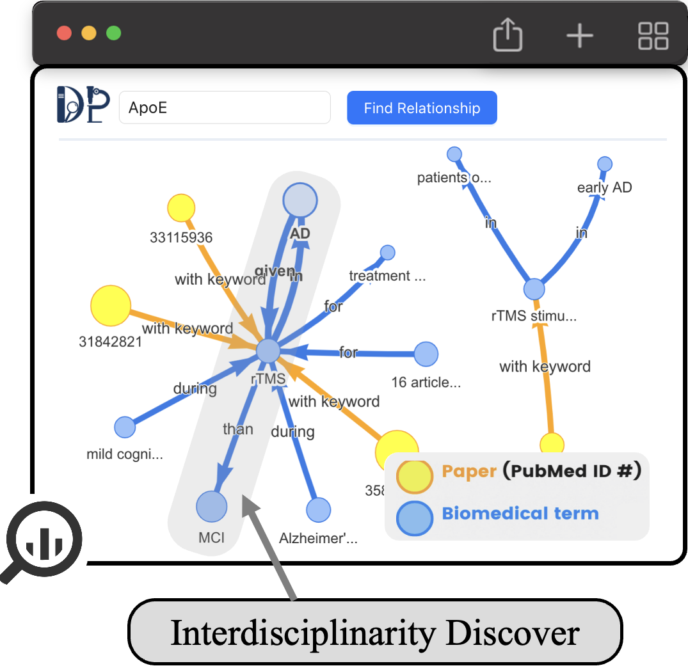
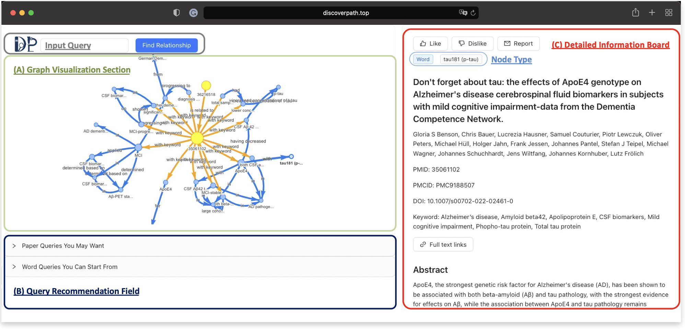
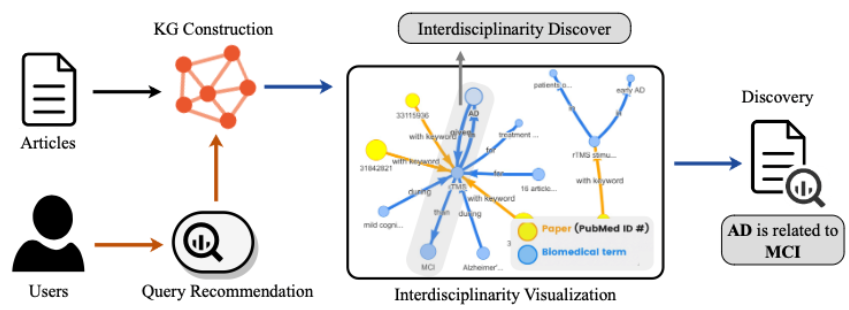
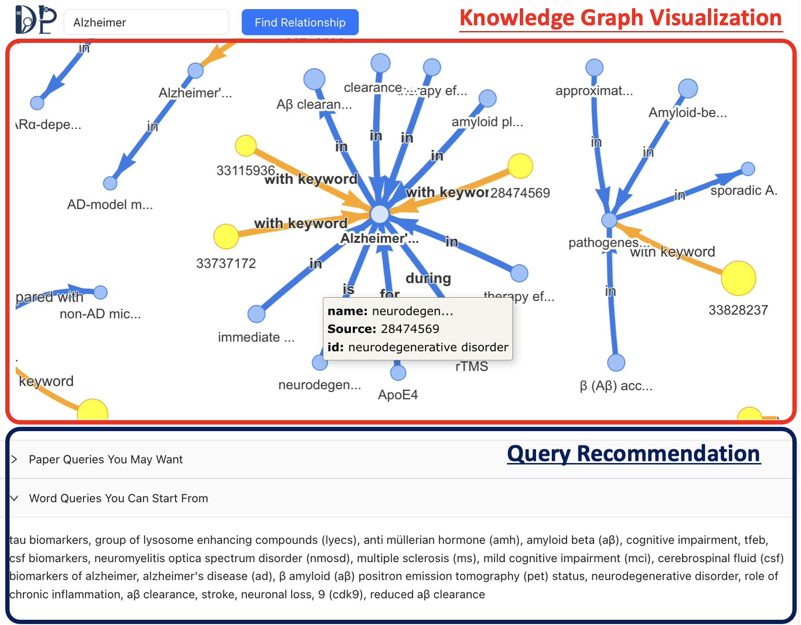

# DiscoverPath: A Knowledge Refinement and Retrieval System for Interdisciplinarity on Biomedical Research


DiscoverPath is a Knowledge Graphs (KGs) based paper search engine for biomedical research. It addresses scenarios where users encounter challenges in pinpointing suitable search queries, particularly in interdisciplinary fields where researchers from diverse backgrounds tend to employ diverse terminologies to describe similar research. In contrast to conventional keyword-based paper search engines like Google Scholar and PubMed, DiscoverPath visualizes the papers and queries that are related to the given query with KGs, facilitating the users to develop a progressive “path” toward discovering the most relevant papers. DiscoverPath is developed by [Data Lab](https://cs.rice.edu/~xh37/) at Rice University.

:mega: We have released our paper and demo video to help readers better understand the DiscoverPath system.
* Paper: [https://arxiv.org/pdf/2309.01808](https://arxiv.org/pdf/2309.01808)
* Demo Video: [https://youtu.be/xcDzBl7jp-s](https://youtu.be/xcDzBl7jp-s)
* Poster: [https://reurl.cc/5OvprR](https://drive.google.com/file/d/1_uBTUO6d9Ub22kCfNyRENQLi6Zl_sMaP/view?usp=share_link)
* Do you want to learn more about data pipeline search? Please check out our [data-centric AI survey](https://arxiv.org/abs/2303.10158) and [data-centric AI resources](https://github.com/daochenzha/data-centric-AI)!

## How DiscoverPath works?
The interdisciplinarity information can be discovered by the knowledge graphs presented in DiscoverPath system. The hidden knowledge appears in high-order path of knowledge graphs. Users are allowed to leverage any Cypher Query to find more relationships, such as shortest path of two terms, in the knowledge graphs.
<div align=center>

</div>


## Cite This Work
If you find this project useful, you can cite this work by:

Chuang Yu-Neng, et al. "DiscoverPath: A Knowledge Refinement and Retrieval System for Interdisciplinarity on Biomedical Research"
```bibtex
@article{chuang2023discoverpath,
  title={DiscoverPath: A Knowledge Refinement and Retrieval System for Interdisciplinarity on Biomedical Research},
  author={Chuang, Yu-Neng and Wang, Guanchu and Chang, Chia-Yuan and Lai, Kwei-Herng and Zha, Daochen and Tang, Ruixiang and Yang, Fan and Reyes, Alfredo Costilla and Zhou, Kaixiong and Jiang, Xiaoqian and others},
  journal={arXiv preprint arXiv:2309.01808},
  year={2023}
}
```

## Utilization and Demonstration of DiscoverPath

### Interface
The overall GUI interface of the DiscoverPath system, which consists of a frontend interaction, a backend platform, and a graph database.

<div align=center>

</div>


### Utilization
A using pipeline overview of DiscoverPath based on a client-server architecture. DiscoverPath follows a pipeline to gradually refine the knowledge graphs that meet the requirements of users. Users first give their initial queries to get the initial knowledge graphs, and then utilize the recommended queries to refine the initial one before visualizing the Interdisciplinary knowledge.

<div align=center>

</div>

### Demonstration
DiscoverPath system shows the results of interdisciplinary knowledge exploration. We here select serveral results in Alzheimer’s disease, which is shown as follows:

<div align=center>

</div>

## Developed Environment
### Install packages
```sh
-  OpenJDK 1.8
-  Python 3.7
-  neo4j 3.5
```

### Start neo4j server
```sh
<NEO4J_HOME>/bin/neo4j console
<NEO4J_HOME>/bin/neo4j start
./bin/neo4j-admin set-initial-password <Your_Password>
```

### Initiaize Neo4j Data
Given a knowledge graph triplets input:
```txt
Paper_A Relation_1 Term_A
Paper_A Relation_1 Term_B
Paper_A Relation_1 Term_D
Paper_B Relation_1 Term_B
Paper_B Relation_1 Term_C
Paper_A Related_paper Paper_B 
```

Then initiaize 
```sh
python clean.py
python neo2example.py
```
